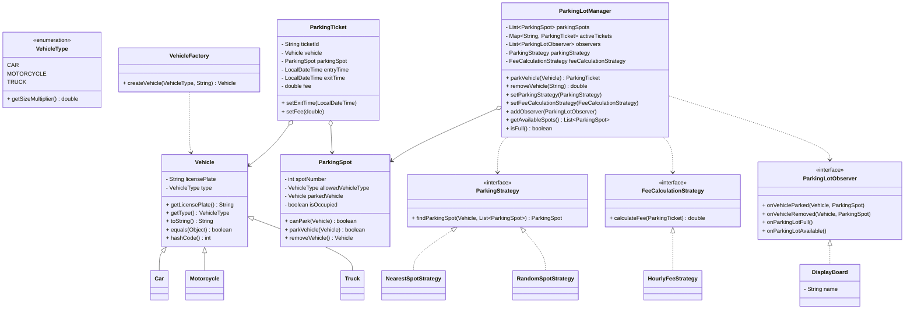

# Parking Lot Management System

A comprehensive parking lot management system implemented in Java, demonstrating **SOLID principles** and **Design Patterns**.

## 🏗️ Architecture Overview

This system is designed with clean architecture principles, ensuring maintainability, extensibility, and testability.

## 📊 Class Diagram

```
┌─────────────────────────────────────────────────────────────────────────────────┐
│                           PARKING LOT SYSTEM CLASS DIAGRAM                      │
└─────────────────────────────────────────────────────────────────────────────────┘

┌─────────────────────┐    ┌─────────────────────┐    ┌─────────────────────┐
│      Vehicle        │    │    VehicleType      │    │   ParkingSpot       │
│    (Abstract)       │    │     (Enum)          │    │                     │
├─────────────────────┤    ├─────────────────────┤    ├─────────────────────┤
│ - licensePlate      │    │ CAR(1.0)            │    │ - spotNumber        │
│ - type              │    │ MOTORCYCLE(0.5)     │    │ - allowedVehicleType│
├─────────────────────┤    │ TRUCK(2.0)          │    │ - parkedVehicle     │
│ + getLicensePlate() │    │                     │    │ - isOccupied        │
│ + getType()         │    │ + getSizeMultiplier()│    ├─────────────────────┤
│ + toString()        │    └─────────────────────┘    │ + canPark()         │
│ + equals()          │                               │ + parkVehicle()     │
│ + hashCode()        │                               │ + removeVehicle()   │
└─────────────────────┘                               └─────────────────────┘
         △                                                       △
         │                                                       │
    ┌────┴────┐                                                 │
    │         │                                                 │
┌───▼───┐ ┌──▼──┐ ┌─────▼─────┐                               │
│  Car  │ │Truck│ │Motorcycle │                               │
└───────┘ └─────┘ └───────────┘                               │
                                                               │
┌─────────────────────┐    ┌─────────────────────┐            │
│   ParkingTicket     │    │  VehicleFactory     │            │
│                     │    │   (Factory)         │            │
├─────────────────────┤    ├─────────────────────┤            │
│ - ticketId          │    │ + createVehicle()   │◄───────────┘
│ - vehicle           │    │   (static)          │
│ - parkingSpot       │    └─────────────────────┘
│ - entryTime         │
│ - exitTime          │    ┌─────────────────────┐
│ - fee               │    │ ParkingStrategy     │
├─────────────────────┤    │   (Interface)       │
│ + setExitTime()     │    ├─────────────────────┤
│ + setFee()          │    │ + findParkingSpot() │
│ + getters...        │    └─────────────────────┘
└─────────────────────┘             △
                                    │
                        ┌───────────┴───────────┐
                        │                       │
            ┌───────────▼───────────┐ ┌────────▼────────┐
            │ NearestSpotStrategy   │ │RandomSpotStrategy│
            │                       │ │                 │
            ├───────────────────────┤ ├─────────────────┤
            │ + findParkingSpot()   │ │+ findParkingSpot│
            └───────────────────────┘ └─────────────────┘

┌─────────────────────┐    ┌─────────────────────┐
│FeeCalculationStrategy│    │ParkingLotObserver   │
│   (Interface)       │    │   (Interface)       │
├─────────────────────┤    ├─────────────────────┤
│ + calculateFee()    │    │ + onVehicleParked() │
└─────────────────────┘    │ + onVehicleRemoved()│
         △                 │ + onParkingLotFull()│
         │                 │ + onParkingLotAvail()│
┌────────▼────────┐        └─────────────────────┘
│HourlyFeeStrategy│                 △
│                 │                 │
├─────────────────┤        ┌────────▼────────┐
│+ calculateFee() │        │  DisplayBoard   │
└─────────────────┘        │                 │
                           ├─────────────────┤
┌─────────────────────────────────────────┐  │ - name          │
│         ParkingLotManager               │  │ + onVehicle...()│
│                                         │  └─────────────────┘
├─────────────────────────────────────────┤
│ - parkingSpots: List<ParkingSpot>       │
│ - activeTickets: Map<String,Ticket>     │
│ - observers: List<ParkingLotObserver>   │
│ - parkingStrategy: ParkingStrategy      │
│ - feeCalculationStrategy: FeeCalcStrat  │
├─────────────────────────────────────────┤
│ + parkVehicle(Vehicle): ParkingTicket   │
│ + removeVehicle(String): double         │
│ + setParkingStrategy(ParkingStrategy)   │
│ + setFeeCalculationStrategy(FeeCalcStr) │
│ + addObserver(ParkingLotObserver)       │
│ + getAvailableSpots(): List<ParkingSpot>│
│ + isFull(): boolean                     │
└─────────────────────────────────────────┘
```
Additionally, here is the same diagram in Mermaid format for IDEs/viewers that support it:



## 🎯 SOLID Principles Implementation

### 1. **Single Responsibility Principle (SRP)**
Each class has a single, well-defined responsibility:

- **`Vehicle`**: Manages vehicle information only
- **`ParkingSpot`**: Handles parking spot state and operations
- **`ParkingTicket`**: Manages ticket information and timing
- **`VehicleFactory`**: Creates vehicle instances only
- **`DisplayBoard`**: Handles display notifications only
- **`ParkingLotManager`**: Coordinates parking lot operations

### 2. **Open/Closed Principle (OCP)**
The system is open for extension but closed for modification:

- **Vehicle hierarchy**: New vehicle types can be added by extending `Vehicle`
- **Strategy patterns**: New parking and fee calculation strategies can be added
- **Observer pattern**: New observers can be added without modifying existing code

### 3. **Liskov Substitution Principle (LSP)**
Derived classes can be substituted for their base classes:

- **Vehicle subclasses** (`Car`, `Motorcycle`, `Truck`) can be used wherever `Vehicle` is expected
- **Strategy implementations** can be substituted without affecting client code

### 4. **Interface Segregation Principle (ISP)**
Interfaces are focused and specific:

- **`ParkingStrategy`**: Only defines parking spot finding behavior
- **`FeeCalculationStrategy`**: Only defines fee calculation behavior  
- **`ParkingLotObserver`**: Only defines notification methods

### 5. **Dependency Inversion Principle (DIP)**
High-level modules depend on abstractions, not concretions:

- **`ParkingLotManager`** depends on `ParkingStrategy` interface, not concrete implementations
- **`ParkingLotManager`** depends on `FeeCalculationStrategy` interface
- **`ParkingLotManager`** depends on `ParkingLotObserver` interface

## 🎨 Design Patterns Implementation

### 1. **Factory Pattern** 
**Location**: `VehicleFactory`

**Purpose**: Creates vehicle objects without exposing creation logic

**Implementation**:
```java
Vehicle car = VehicleFactory.createVehicle(VehicleType.CAR, "ABC-123");
```

**Benefits**:
- Encapsulates object creation
- Easy to add new vehicle types
- Centralized vehicle creation logic

### 2. **Strategy Pattern**
**Locations**: `ParkingStrategy`, `FeeCalculationStrategy`

**Purpose**: Allows algorithms to be selected at runtime

**Implementation**:
```java
// Parking strategies
parkingLot.setParkingStrategy(new NearestSpotStrategy());
parkingLot.setParkingStrategy(new RandomSpotStrategy());

// Fee calculation strategies  
parkingLot.setFeeCalculationStrategy(new HourlyFeeStrategy());
```

**Benefits**:
- Runtime algorithm selection
- Easy to add new strategies
- Follows Open/Closed Principle

### 3. **Observer Pattern**
**Locations**: `ParkingLotObserver`, `DisplayBoard`

**Purpose**: Notifies multiple objects about parking lot events

**Implementation**:
```java
DisplayBoard display = new DisplayBoard("Main Display");
parkingLot.addObserver(display);
```

**Benefits**:
- Loose coupling between subject and observers
- Dynamic subscription/unsubscription
- Multiple observers can react to same event

## 📁 Project Structure

```
ParkingLotSystem/
├── src/main/java/com/parkinglot/
│   ├── model/
│   │   ├── Vehicle.java              # Abstract vehicle class
│   │   ├── VehicleType.java          # Vehicle type enumeration
│   │   ├── Car.java                  # Car implementation
│   │   ├── Motorcycle.java           # Motorcycle implementation
│   │   ├── Truck.java                # Truck implementation
│   │   ├── ParkingSpot.java          # Parking spot entity
│   │   └── ParkingTicket.java        # Parking ticket entity
│   ├── strategy/
│   │   ├── ParkingStrategy.java      # Parking strategy interface
│   │   ├── NearestSpotStrategy.java  # Nearest spot implementation
│   │   ├── RandomSpotStrategy.java   # Random spot implementation
│   │   ├── FeeCalculationStrategy.java # Fee calculation interface
│   │   └── HourlyFeeStrategy.java    # Hourly fee implementation
│   ├── factory/
│   │   └── VehicleFactory.java       # Vehicle factory
│   ├── observer/
│   │   ├── ParkingLotObserver.java   # Observer interface
│   │   └── DisplayBoard.java         # Display board observer
│   ├── service/
│   │   └── ParkingLotManager.java    # Main parking lot manager
│   └── ParkingLotApplication.java    # Main application
└── README.md                         # This file
```

## 🚀 How to Run

### Prerequisites
- Java 11 or higher
- Any Java IDE (IntelliJ IDEA, Eclipse, VS Code)
- Optional: Apache Maven 3.8+

### Steps to Run

1. **Clone or Download** the project to your local machine

2. **Navigate to the project directory**:
   ```bash
   cd C:\Users\Scaler\CascadeProjects\ParkingLotSystem
   ```

3. Run with Maven (recommended):
   - Compile and run directly:
     ```bash
     mvn -q exec:java
     ```
   - Or package then run:
     ```bash
     mvn -q package
     java -cp target/classes com.parkinglot.ParkingLotApplication
     ```

4. Run without Maven (Windows):
   - Use the provided script for one-click compile and run:
     ```bat
     run.bat
     ```
   - Or compile manually:
     ```bash
     javac -d out src/main/java/com/parkinglot/ParkingLotApplication.java src/main/java/com/parkinglot/model/*.java src/main/java/com/parkinglot/strategy/*.java src/main/java/com/parkinglot/factory/*.java src/main/java/com/parkinglot/observer/*.java src/main/java/com/parkinglot/service/*.java
     java -cp out com.parkinglot.ParkingLotApplication
     ```

### Alternative: Using IDE
1. Open the project in your preferred Java IDE
2. Set the source folder to `src/main/java`
3. Run the `ParkingLotApplication.java` file

## 🔧 Key Features

### Core Functionality
- **Vehicle Parking**: Park cars, motorcycles, and trucks
- **Spot Assignment**: Automatic spot assignment using configurable strategies
- **Fee Calculation**: Calculate parking fees based on time and vehicle type
- **Real-time Notifications**: Display boards show parking events
- **Ticket Management**: Generate and manage parking tickets

### Extensibility Features
- **Multiple Parking Strategies**: Nearest spot, random spot (easily extensible)
- **Multiple Fee Strategies**: Hourly rates (easily extensible)
- **Observer Notifications**: Multiple display boards can be added
- **Vehicle Types**: Easy to add new vehicle types

## 📋 Function Explanations

### Core Classes

#### `Vehicle` (Abstract Class)
- **Purpose**: Base class for all vehicles
- **Key Methods**:
  - `getLicensePlate()`: Returns vehicle license plate
  - `getType()`: Returns vehicle type
  - `equals()` & `hashCode()`: For proper object comparison

#### `ParkingSpot`
- **Purpose**: Represents a parking spot
- **Key Methods**:
  - `canPark(Vehicle)`: Checks if vehicle can park in this spot
  - `parkVehicle(Vehicle)`: Parks a vehicle in the spot
  - `removeVehicle()`: Removes vehicle from spot

#### `ParkingLotManager`
- **Purpose**: Main coordinator for parking operations
- **Key Methods**:
  - `parkVehicle(Vehicle)`: Parks a vehicle and returns ticket
  - `removeVehicle(String)`: Removes vehicle using ticket ID
  - `setParkingStrategy()`: Sets parking spot assignment strategy
  - `setFeeCalculationStrategy()`: Sets fee calculation method
  - `addObserver()`: Adds notification observer

### Strategy Classes

#### `NearestSpotStrategy`
- **Purpose**: Finds the nearest available parking spot
- **Algorithm**: Returns first available spot that matches vehicle type

#### `RandomSpotStrategy`  
- **Purpose**: Finds a random available parking spot
- **Algorithm**: Randomly selects from available spots matching vehicle type

#### `HourlyFeeStrategy`
- **Purpose**: Calculates fees based on hourly rates
- **Algorithm**: Base rate × hours × vehicle size multiplier

### Observer Classes

#### `DisplayBoard`
- **Purpose**: Shows parking lot events on display boards
- **Events Handled**:
  - Vehicle parked/removed notifications
  - Parking lot full/available notifications

## 🎯 Example Usage

```java
// Create parking lot manager
ParkingLotManager parkingLot = new ParkingLotManager(5, 3, 2);

// Set strategies
parkingLot.setParkingStrategy(new NearestSpotStrategy());
parkingLot.setFeeCalculationStrategy(new HourlyFeeStrategy());

// Add observers
parkingLot.addObserver(new DisplayBoard("Main Display"));

// Create and park vehicle
Vehicle car = VehicleFactory.createVehicle(VehicleType.CAR, "ABC-123");
ParkingTicket ticket = parkingLot.parkVehicle(car);

// Remove vehicle and calculate fee
double fee = parkingLot.removeVehicle(ticket.getTicketId());
```

## 🔄 Expected Output

When you run the application, you'll see:

```
=== Parking Lot Management System ===

=== Parking Vehicles ===
[Main Display] Vehicle ABC-123 parked at spot 1
[Entrance Display] Vehicle ABC-123 parked at spot 1
Ticket issued: TICKET-1
[Main Display] Vehicle XYZ-789 parked at spot 2
[Entrance Display] Vehicle XYZ-789 parked at spot 2
Ticket issued: TICKET-2
[Main Display] Vehicle BIKE-123 parked at spot 6
[Entrance Display] Vehicle BIKE-123 parked at spot 6
Ticket issued: TICKET-3
[Main Display] Vehicle TRUCK-001 parked at spot 9
[Entrance Display] Vehicle TRUCK-001 parked at spot 9
Ticket issued: TICKET-4

=== Parking Lot Status ===
Total spots: 10
Occupied spots: 4
Available spots: 6
Is full: false

All parking spots:
Spot 1 (CAR) - OCCUPIED by CAR with license plate: ABC-123
Spot 2 (CAR) - OCCUPIED by CAR with license plate: XYZ-789
Spot 3 (CAR) - AVAILABLE
...

=== Removing Vehicles ===
[Main Display] Vehicle ABC-123 removed from spot 1
[Entrance Display] Vehicle ABC-123 removed from spot 1
Vehicle removed. Fee charged: $2.00
```

## 🏆 Benefits of This Design

1. **Maintainable**: Each class has a single responsibility
2. **Extensible**: Easy to add new vehicle types, strategies, and observers
3. **Testable**: Loose coupling makes unit testing easier
4. **Flexible**: Runtime strategy changes supported
5. **Scalable**: Observer pattern supports multiple notification systems
6. **Robust**: Proper error handling and validation

## 🔮 Future Enhancements

- **Database Integration**: Persist parking data
- **Web Interface**: REST API for parking operations
- **Payment Integration**: Online payment processing
- **Reservation System**: Advance spot booking
- **Analytics**: Parking usage statistics
- **Mobile App**: Mobile interface for users

---

This parking lot system demonstrates professional software design principles and is ready for production use with minimal modifications.
